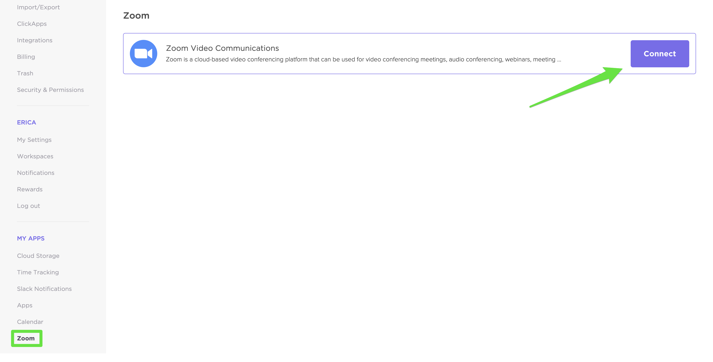
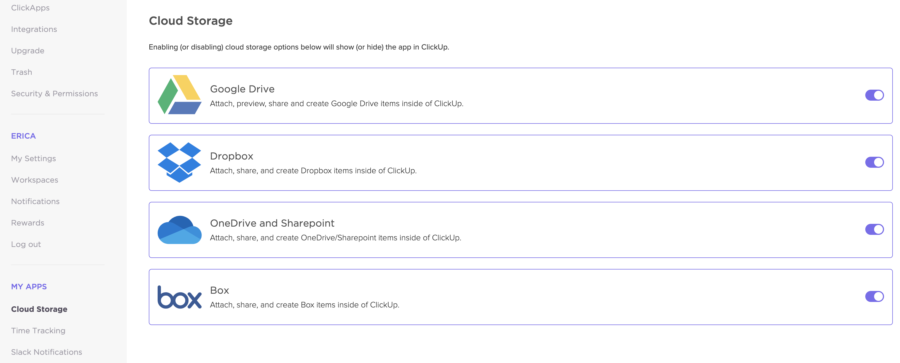

# ClickUp Setup
{: .no_toc }

## Guide sections
{: .no_toc .text-delta }

- TOC
{:toc}

## Overview

ClickUp is the project management application used by the Office of Institutional Effectiveness.  To begin using the software, login at [ClickUp][clickup].  The application offers additional functionalities that can help integrate with your daily workflow, as described below.

## Desktop and mobile clients

In addition to the web interface at clickup.com, there are desktop clients for Mac and Windows, and mobile clients for iOS and Android.  There is also a Chrome browser extension.  These clients may be downloaded at [ClickUp Apps][clickup-apps].

## Integrations

Individual integrations on ClickUp are enabled by the site administrator (the executive director).  The following integrations have been enabled, which means they are available for your use.  To setup the individual integration to work with your account, select your profile and go to "Settings".  You'll see "My Apps" along the left hand menu bar. 

### Slack

The Slack integration allows you to create customized notifications in Slack, create ClickUp tasks from within Slack, turn messages into tasks, and more.

To authorize ClickUp to communicate with your personal Slack account, please follow this link to your [Slack settings][cu-slack-auth].  Click the "Slack" button and you will be redirected to Slack, and asked to grant ClickUp access to the application.

For more information, see the [Slack Integration - ClickUp Tutorial][cu-slack].

### Outlook

The Outlook integration allows you to create tasks from email, attach email to tasks, and manage ClickUp directly from Outlook.

To use the Outlook integration, you must install the ClickUp Add In for Outlook.  From Outlook, click "Store" or "Get Add-ins" from the top menu bar.  Search for "ClickUp" and click "Add".  Once the add-in has been installed, from any email you will then be able to access the "ClickUp" button in the toolbar.

For more information, see the [Outlook Integration - ClickUp Tutorial][cu-outlook].

### Zoom

The Zoom integration allows you to start a meeting directly from a task.  When a meeting is started, the link to join will automatically be posted in a comment, and watchers will be notified. The unfurled link includes a quick join button and other details about the meeting in progress. When the meeting ends, a link to the recording (if recording was enabled) will also be added to your task automatically.

DSU has purchased an enterprise license, so each member of the team now has an individual Zoom account.  To connect your Zoom account, select "Zoom" under the "My Apps" heading in settings.  Click "Connect", and sign-in with your Zoom account.  When prompted, accept the ClickUp request to add it to your account.

For more information, see the [Zoom Integration - ClickUp Tutorial][cu-zoom].

### Google Drive

The Google Drive integration allows you to attach files, paste URLs to files, or create Google Docs from within the application.

The Google Drive integration allows you to authorize one cloud storage account for each workspace.  (Generally, you should authorize your 'dixie.edu' Google account for each workspace, although this is ultimately left to your discretion.)  To authorize your Google account, select "Cloud Storage" under the "My Apps" heading in settings.  Toggle the Google Drive integation, and authorize the application for your workspace.

For more information, see the [Cloud Storage Integration - ClickUp Tutorial][cu-cloud].

### GitHub

The GitHub integration alows you to associate GitHub pull requests, branches, and commits with ClickUp tasks.  You can see all GitHub activity related to an associated task or change ClickUp statuses from within GitHub.

The GitHub integration requires an administrator to attach specific GitHub repositories to specific workspaces within ClickUp.  If you have a repository that you would like attached to a workspace, please ask the administrator to complete the request.  ClickUp also allows you to authorize GitHub within your workspace and to customize which repositories you share.  To connect your GitHub account, select "GitHub" under the "My Apps" heading in settings.  Click the "Connect" button to login to your GitHub profile.

For more information, see the [GitHub Integration - ClickUp Tutorial][cu-github].

 
[clickup]: https://app.clickup.com/
    "ClickUp"
[clickup-apps]: https://clickup.com/apps
    "ClickUp Apps"
[cu-zoom]: https://docs.clickup.com/en/articles/3922396-zoom-integration
    "ClickUp Zoom Tutorial"
[cu-cloud]: https://docs.clickup.com/en/articles/1761638-cloud-storage-google-drive-dropbox-onedrive-sharepoint-box
    "ClickUp Cloud Storage Tutorial"
[cu-slack-auth]: https://app.clickup.com/8425467/settings/slack
    "ClickUp Slack Authorization"
[cu-slack]: https://docs.clickup.com/en/articles/2823124-slack
    "ClickUp Slack Tutorial"
[cu-slack-blog]: https://clickup.com/blog/slack-project-management-integration/
    "ClickUp and Slack Blog Post"
[cu-outlook]: https://docs.clickup.com/en/articles/2704944-outlook-integration
    "ClickUp Outlook Tutorial"
[cu-github]: https://docs.clickup.com/en/articles/856285-github
    "ClickUp GitHub Tutorial"